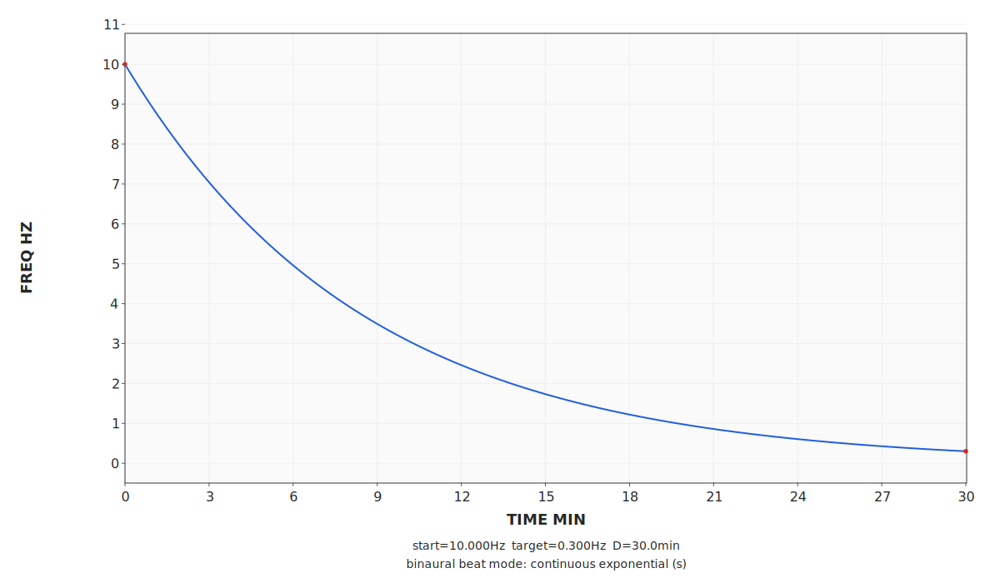

# SBaGenX

SBaGenX is a scriptable audio-generation toolkit for brainwave-style sessions: a command-line interface, a desktop GUI, a reusable C library (`sbagenxlib`), plotting/video tools, and an Android frontend built on the same engine.



## Why it is interesting

- Build sessions from `.sbg` sequence files or built-in programs such as `drop`, `sigmoid`, `slide`, and `curve`.
- Design function-driven sessions with `.sbgf` curve files, `solve`, and reusable parameter sets.
- Preview beat graphs, isochronic envelopes, and graph videos instead of flying blind.
- Reuse the same runtime through the CLI, the desktop GUI, and external frontends via `sbagenxlib`.
- Install the CLI and desktop GUI together from one Windows installer or one Ubuntu package.

## Try it in under 2 minutes

### Windows

1. Download `sbagenx-windows-setup.exe` from the [releases page](https://github.com/lm7137/SBaGenX/releases).
2. Open a terminal.
3. Run:

```bash
sbagenx -h
sbagenx -m river1.ogg -p drop 00ds+ mix/99
sbagenx -P -p sigmoid t30,30,0 00ls+:l=0.2:h=0
```

### Ubuntu (amd64)

```bash
sudo apt install ./sbagenx_*_amd64.deb
sbagenx -h
sbagenx -m river1.ogg -p drop 00ds+ mix/99
```

### One curve example

```bash
sbagenx -p curve examples/basics/curve-sigmoid-like.sbgf 00ls:l=0.2:h=0
```

## Release channels

- Stable: use the latest non-`alpha` release from the [releases page](https://github.com/lm7137/SBaGenX/releases) if you want the safest install path.
- Alpha: use `alpha` releases if you want to test new engine, GUI, and packaging changes early. Alpha builds are for testers and early adopters, not for conservative installs.

## Ecosystem

- Core CLI, desktop GUI, and shared library: this repo
- Android frontend: [SBaGenX-Android](https://github.com/lm7137/SBaGenX-Android)
- Website and docs: [sbagenx.com](https://www.sbagenx.com)
- GUI reference: [`docs/GUI_REFERENCE.md`](docs/GUI_REFERENCE.md)
- Core reference manual: [`docs/SBAGENX.txt`](docs/SBAGENX.txt)
- Library API: [`docs/SBAGENXLIB_API.md`](docs/SBAGENXLIB_API.md)
- Library quickstart: [`docs/SBAGENXLIB_QUICKSTART.md`](docs/SBAGENXLIB_QUICKSTART.md)
- Examples: [`examples/`](examples/)

## What this repo contains

- `sbagenx`: the CLI frontend for authoring, playback, plotting, and export
- `gui/`: the desktop GUI frontend
- `sbagenxlib`: the shared engine used by the CLI, GUI, and external integrations
- build scripts for Windows, Ubuntu/Linux, macOS, and Android codec inputs
- examples, plots, and documentation intended to be usable immediately after install

## What SBaGenX adds over older SBaGen lineages

- function-driven built-in programs, including `sigmoid` and `curve`
- reusable `.sbgf` curve files with `solve`
- `customNN`, `spinNN`, and `noiseNN` families
- `noisepulse` and `noisebeat` generated-noise tone modes
- expanded mix processing including `mixpulse`, `mixbeat`, and `mixam`
- one-cycle plot output, beat graphs, and graph-video export
- reusable `sbagenxlib` headers, shared/static libraries, and pkg-config metadata

## Build and packaging

- Unified Linux build: `bash linux-build-all.sh`
- Unified Windows build: `bash windows-build-all.sh`
- Docker build workflow: see `Dockerfile` and `compose.yml`

For detailed usage and build notes, use:

- [`USAGE.md`](USAGE.md)
- [`docs/ARCHITECTURE.md`](docs/ARCHITECTURE.md)
- [`gui/README.md`](gui/README.md)

## Contributing

See [`CONTRIBUTING.md`](CONTRIBUTING.md) before opening a pull request.

Short version:

- use Discussions for open-ended ideas and presets
- use Issues for concrete bugs, documentation gaps, and feature proposals
- land behavior changes in `sbagenxlib` first when they affect multiple frontends
- include docs, tests, and examples where the change materially alters behavior

## License

See [`COPYING.txt`](COPYING.txt), [`NOTICE.txt`](NOTICE.txt), and the `licenses/` directory.

## Credits and lineage

SBaGenX continues the SBaGen lineage:

- original SBaGen by Jim Peters
- SBaGen+ fork by Ruan Klein
- current continuation and expansion in SBaGenX

The project is now explicitly library-first: `sbagenxlib` is the shared engine, while the CLI and GUI are frontends around it.
